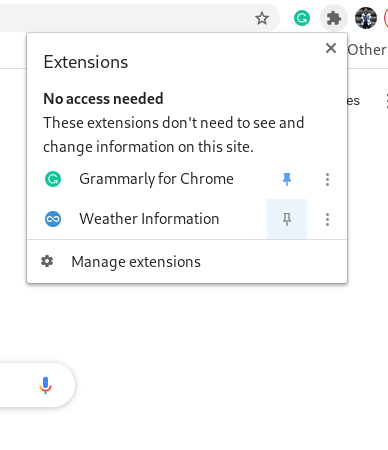
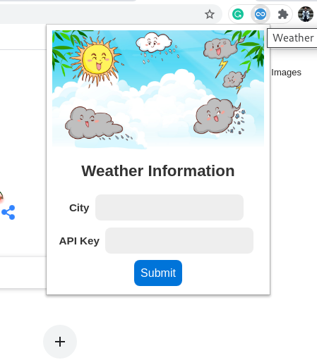
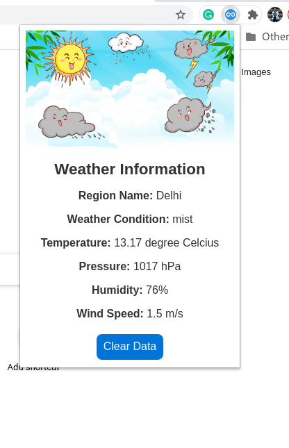

# Weather Chrome Extension

A simple chrome extension developed to get the current weather directly in the browser by simply clicking on it.

## How to install

To install the extension just clone the repository using the ```git clone``` command. Then open the Chrome Browser open the url <a href="chrome://extensions/">chrome://extensions/</a> This will open the extension tab of chrome. There is an button to **load unpacked** in the top of the window. Click on the load unpacked button and open the **dist** folder of WeatherChromeExtension. After loading the **dist** folder of WeatherChromeExtension using the load unpacked option the extension will be installed in the chrome.

## How to use

To use the extension first install it using the above methods. After installing pin the extension as shown in the below image.
<br><br>

<br><br>
After that click on the blue icon of the extension which will popup a page as shown in the below image.

<br><br>

<br><br>

Enter the city name in the first input and enter the api key of openweathermap api in the second input. You can get a free api key from the <a href="">openweathermap api website</a>. After entering and submitting the api key you will get the weather information for that City. See the below image for illustration.

<br><br>

<br><br>

## Technical Details

The extension takes the city name and openweathermap Api Key as input. Pulls the current weather information of the city from the openweathermap api and display the result. The extension also saves the city and API key in the browser's local storage so a user not required to input the data mutiple times.

Any improvements to the extnsions are accepted. Thanks in advance for the contributions.